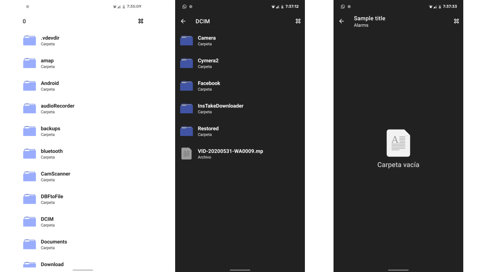

# Material File Picker Unofficial

Material file picker library for Android by Arte al Programar



## What's new

- Require Android Jelly Bean 4.1.x (API 16+)
- Android 11 Compatibility with permission all files (android.permission.MANAGE_EXTERNAL_STORAGE)
- Material Components for Android Support
- Night Mode Support
- New Icon Designs

## Add your project

Using Jcenter

```
build.gradle (Project)

allprojects {
    repositories {
        maven { url 'https://jitpack.io' }
    }
}


build.gradle (Module: app)

dependencies {
    ...
    implementation 'androidx.activity:activity-ktx:1.3.1'
    implementation 'androidx.fragment:fragment-ktx:1.3.6'
    implementation 'com.github.arteaprogramar:Android-MaterialFilePicker:2.1.0'
}


```

## Using (IMPORTANT)

- Add to Values

```
colors.xml 
<resources>
    ...
    <color name="colorBackground">#fafafa</color>
    
    <!-- Android API 31 Required -->
    <color name="colorBackground">#fafafa</color>
    <color name="textColorPrimary">#212121</color>
    <color name="colorControlHighlight">#4000695C</color>
    <color name="colorPrimaryDarkVariant">#8a000000</color>
    <color name="colorPrimaryDark">#FFFFFFFF</color>
    <color name="colorAccent">#1A237E</color>
    <color name="colorPrimary">#FFFFFFFF</color>
    
    ...
</resources>

styles.xml

<resources>

    ...
    <item name="android:colorBackground">@color/colorBackground</item>
    ...
</resources>

```

- Open your class and add the following code

```
...
kotlin 

/** 
 *  This library require "Activity Result" API 
 **/

private val startForResultFiles = registerForActivityResult(
    ActivityResultContracts.StartActivityForResult()
) { result: ActivityResult ->
    onActivityResult(result.resultCode, result.data)
} 
 
...

// External Storage Path
val externalStorage = FileUtils.getFile(applicationContext, null)

MaterialFilePicker()
        // Pass a source of context. Can be:
        //    .withActivity(Activity activity)
        //    .withFragment(Fragment fragment)
        //    .withSupportFragment(androidx.fragment.app.Fragment fragment)
        .withActivity(this)
        // With cross icon on the right side of toolbar for closing picker straight away
        .withCloseMenu(true)
        // Entry point path (user will start from it)
        //.withPath(alarmsFolder.absolutePath)
        // Root path (user won't be able to come higher than it)
        .withRootPath(externalStorage.absolutePath)
        // Showing hidden files
        .withHiddenFiles(true)
        // Want to choose only jpg images
        .withFilter(Pattern.compile(".*\\.(jpg|jpeg)$"))
        // Don't apply filter to directories names
        .withFilterDirectories(false)
        .withTitle("Sample title")
        // Require "Activity Result" API
        .withActivityResultApi(startForResultFiles)
        .start()
...


/** 
 *  For Android API 29+, You need 
 *  <uses-permission android:name="android.permission.MANAGE_EXTERNAL_STORAGE" /> 
 * And some extra settings.
 * You can check the demo of the application
 **/


```

Override on activity result:

```
kotlin

private fun onActivityResult(resultCode: Int, data: Intent?) {
    if (resultCode == Activity.RESULT_OK) {
        val path: String? = data?.getStringExtra(FilePickerActivity.RESULT_FILE_PATH)

        if (path != null) {
            Log.d("Path: ", path)
            Toast.makeText(this, "Picked file: $path", Toast.LENGTH_LONG).show()
        }
    }
}

```

## Themes

To create a compatible (Light/Dark) theme, you can change the following colors to suit your theme.

```
    <!-- App Colors -->
    <color name="colorPrimary">?colorPrimary</color>
    <color name="colorPrimaryDark">?colorPrimaryDark</color>
    <color name="colorAccent">?colorAccent</color>
    <color name="colorBackground">?android:colorBackground</color>

    <!-- Default Colors -->
    <color name="textColorPrimary">#212121</color>
    <color name="colorControlHighlight">#4000695C</color>

    <!-- (API 21 Status Bar Color) (API 23 Navigation Bar Color)-->
    <color name="colorPrimaryDarkVariant">#8a000000</color>

```